# cerebroViz Basics
cerebroViz is a tool for visualizing spatiotemporal data in the brain. As input, it requires a matrix with rows corresponding to brain regions and columns corresponding to time points. You can learn more about the 30 regions which cerebroViz recognizes in the <a href="#regions">Brain Regions in cerebroViz</a> section.

cerebroViz includes an example matrix, `cerebroEx`,  which fulfills its formatting requirements:
  
```{r, echo=TRUE, fig.show='hold', tidy = TRUE}
library('cerebroViz')
data(cerebroEx)
head(cerebroEx)
```

Calling cerebroViz on this matrix produces two files in the current working directory: one with the suffix "\_outer.svg" and another with the suffix "\_slice.svg". The _outer_ file corresponds to a lobe view of the brain, while the _slice_ file corresponds to a sagittal view. 

```{r, echo=TRUE}
cerebroViz(cerebroEx)

```


***
***

<p align="right"> <a href="#top" >Back to top</a> </p>

## Specifying a Timepoint

cerebroViz allows visualization of brain data temporally, as well as spatially. Multiple time points (corresponding to the columns of a properly formatted matrix) can be specified for rendering by passing an integer vector to the `timePoint = ` argument of `cerebroViz()`. This generates an _outer_ and _slice_ image for each time point, where the number of the corresponding time point is appended to the file name after _outer_ or _slice_. For example: `ex1_outer_1.svg` is the lobe view for the first time point and `ex1_slice_2.svg` is the sagittal view for the second time point. 

```{r, echo=TRUE}
library('cerebroViz')

cerebroViz(cerebroEx, timePoint = c(1:3))
```
##### Timepoint 1


##### Timepoint 2
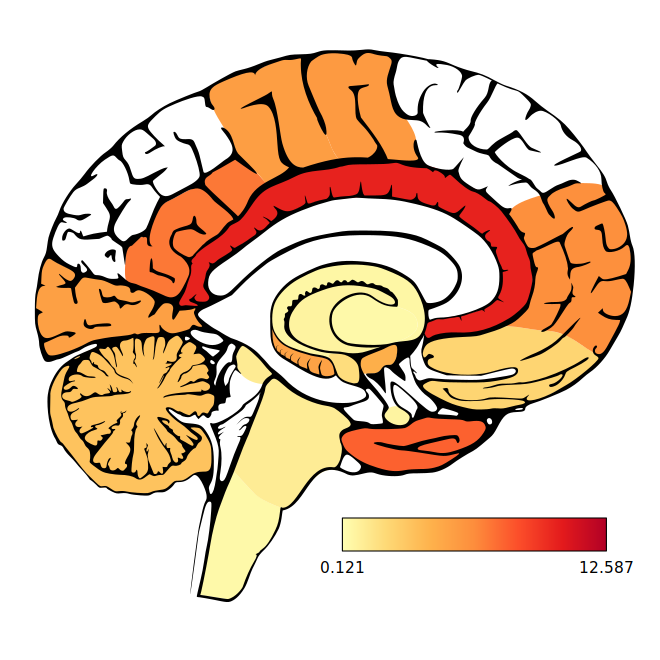

##### Timepoint 3


***
***
<p align="right"> <a href="#top" >Back to top</a> </p>

## Changing the Ouput File

Users may specify a custom prefix for the rendered images with the `filePrefix = ` argument of `cerebroViz()`. The saved filenames with also contain a suffix indicating _outer_ or _slice_ and the requested time point before the file extension. By default, `cerebroViz()` save files to the working directory, but a file path may be passed to `filePrefix = ` so images may be saved elsewhere:

```{r}
library('cerebroViz')

dir.create('custom_directory/')

cerebroViz(cerebroEx, filePrefix = 'custom_directory/a_custom_filename', timePoint = c(1:3))

list.files('custom_directory/')

```

***
***
<p align="right"> <a href="#top" >Back to top</a> </p>

## Divergant Scales

By default, `cerebroViz()` maps input data to a linear color scale. When working with divergent data (e.g. gene expression), it is desirable to have a neutral "middle" color. 

A divergent scale can be specified by passing the `divData = TRUE` argument. In this case, `cerebroViz()` maps the **median** value of all data points in the matrix to a neutral yellow and the extreme values to a pleasant red and blue. 

```{r, echo=TRUE}
library('cerebroViz')

summary(as.vector(cerebroEx))

cerebroViz(cerebroEx, divData = TRUE, filePrefix = 'divergent')
```
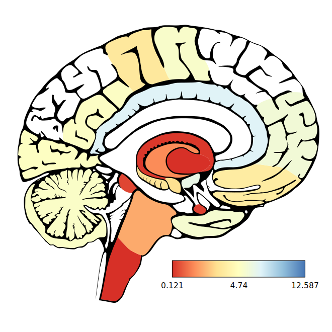

***
***
<p align="right"> <a href="#top" >Back to top</a> </p>

## Clamping Outliers {#clamp}

The removal of outliers from data is crucial to producing interpretable visualizations. For example, if we set the data for the medulla (lower portion of the brain stem) in our example data `cerebroEx` to an extremely high value: 

```{r, echo=TRUE}
cerebroEx -> ex1_out

ex1_out["MED",1] <- 55
```
The medulla has an extremely high signal, and all other values are indistinguishable. 
```{r, echo=TRUE}
cerebroViz(ex1_out, filePrefix = 'outlier')
```
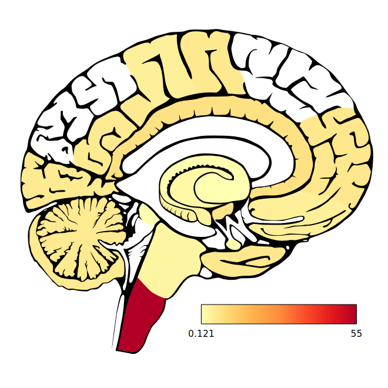

To compensate for outliers, a value can be passed to the `clamp = ` argument of `cerebroViz()`. The *clamp* value is used as a coefficient with the Median Absolute Deviation (MAD) to calculate a range of 'acceptable' values.   

$$median \pm clamp \times MAD $$

Values greater than this range are reduced (or "clamped") to its maximum value, while values less than the range are increased to its minimum. The ideal *clamp* value depends on the shape of the data, but values near 3 are often used as a rule of thumb.  Applying this process to the `ex1_out` matrix, which has been edited to contain an outlier:

```{r, echo=TRUE}
cerebroViz(ex1_out, clamp = 3, filePrefix = 'outlier_clamped')
```
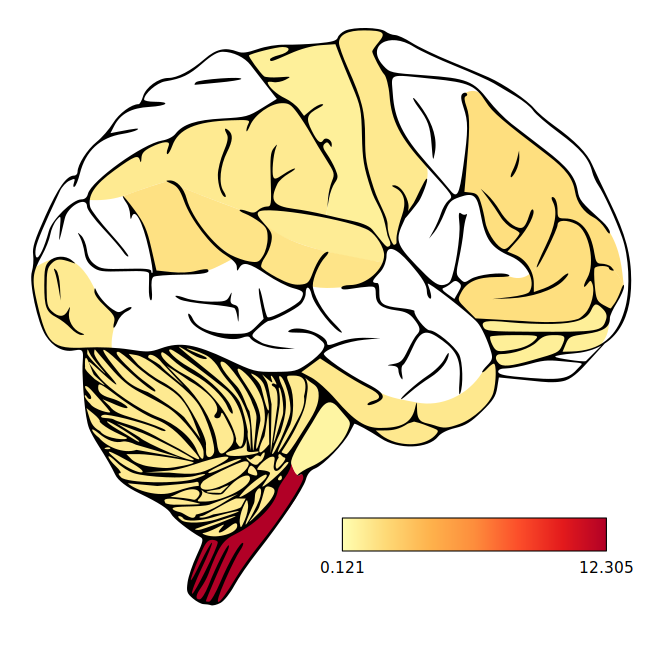


***
***
<p align="right"> <a href="#top" >Back to top</a> </p>

# Customizing cerebroViz's Appearance

### Crosshatching Missing Regions

Depending on specified color schemes, it may be difficult to distinguish a color (likely a neutral color in divergent data) from the background color of the brain. When some data points are missing (NA), corresponding regions may appear to be near the median, when they are actually missing. The argument `naHatch = TRUE` may be passed to `cerebroViz()` to apply a cross-hatch to these regions to help distinguish them from the background or the neutral color.

```{r, echo=TRUE}
cerebroEx -> ex1_NA
ex1_NA["PON",1] <- NA

cerebroViz(ex1_NA, naHatch = TRUE, filePrefix = 'cross_hatch')
```
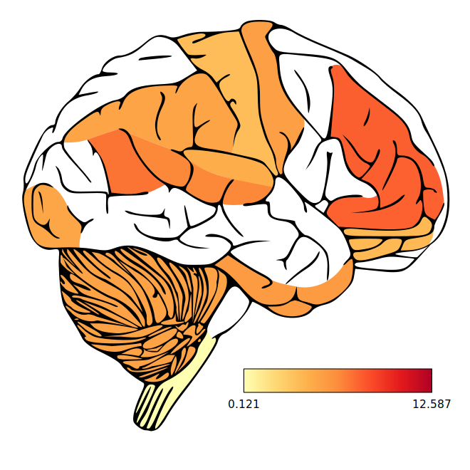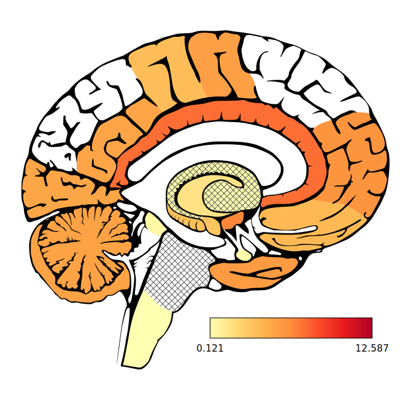

***
<p align="right"> <a href="#top" >Back to top</a> </p>

### Custom color palettes 
The `palette = ` argument of `cerebroViz()` allows a custom color palette to be set for the vizulaization. To define a new palette, we recommend passing the `RColorBrewer::brewer.pal()` function to `palette = `.  In fact, the default palettes for `cerebroViz()` use `brewer.pal()`!

cerebroViz scale                        | RColorBrewer palette
--------------------------------------- | --------------------
`cerebroViz(x, divData = FALSE)` | `brewr.pal(7, "YlOrRd")`
`cerebroViz(x, divData = TRUE)`  | `brewr.pal(7, "RdYlBu")`

`RColorBrewer::brewer.pal()` takes 2 arguments: `n`, the number of colors in the palette; and a `name` corresponding to the palette to use.  We recommend using an odd number of colors whever `divData = TRUE`, ensuring the median is assigned to a known color. 

```{r, echo=TRUE}
library(cerebroViz)
library(RColorBrewer)

cerebroViz(cerebroEx, palette = brewer.pal(5, "BrBG"), divData = TRUE, filePrefix = "brewer")
```
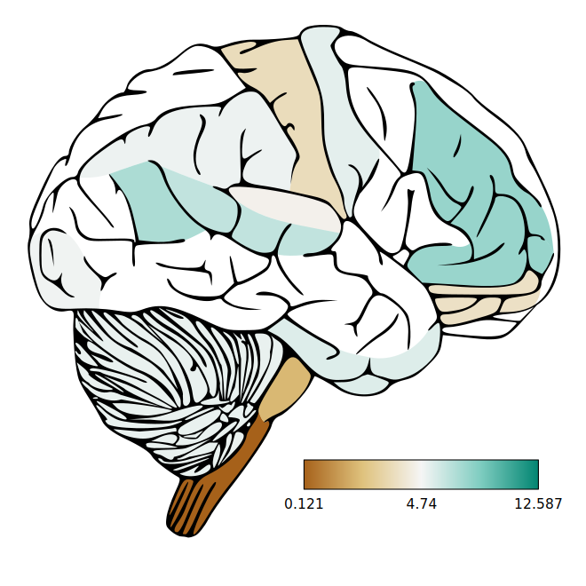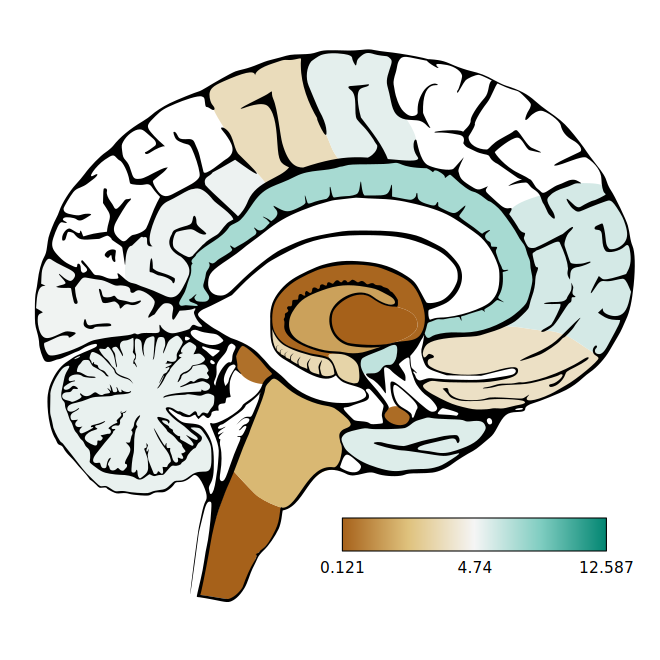

To see a list of palettes available from RColorBrewer, use `RColorBrewer::display.brewer.all()`. More information about `brewer.pal()` can be read in the documentation for RColorBrewer.

***
<p align="right"> <a href="#top" >Back to top</a> </p>

### Advanced custom colors

`cerebroViz()` allows users to fine-tune the color schemes used for both the visualization and the brain background.The color scale to which the data are mapped can be specified by passing a vector of color names, RGB values or hex values with a length of two or greater to the `palette = ` argument:

```{r, echo=TRUE}
library(cerebroViz)

cerebroViz(cerebroEx, palette = c("coral", "antiquewhite", "cornflowerblue"), filePrefix = "custom_scale")
```
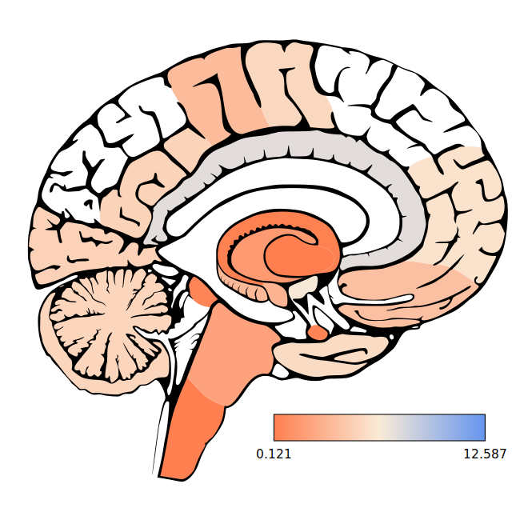

Users are advised to specify an odd number of colors whenever using `divData = TRUE`, ensuring the median is assigned to a known color. 

The color of the brain background ("empty" regions of the brain), brain outline, and image background must be specified, in that order, to the `secPalette = ` argument. Like `palette`, this argument accepts a vector of color names, RGB values or hex values. Unlike `palette`, `secPalette = ` only accepts a vector of length three. 

```{r, echo=TRUE}
library(cerebroViz)

cerebroViz(cerebroEx, secPalette = c("darkgrey", "white", "lightgrey"), filePrefix = "custom_background")
```
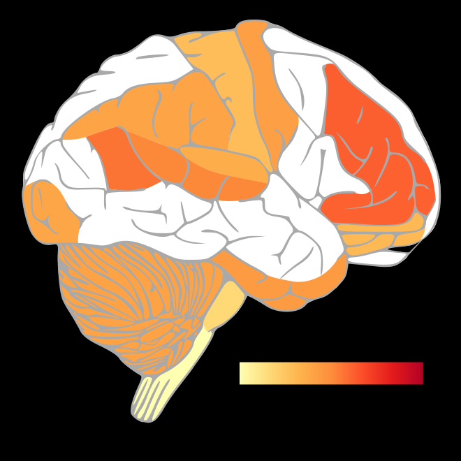

***
***
<p align="right"> <a href="#top" >Back to top</a> </p>

# Generating a heatmap with cerebroScale
Because it is impractical to interpret many cerebroViz diagrams simultaneously, it often makes sense to also visualize the data as a heatmap. In order to account for the custom scaling `cerebroViz()` can perform thanks to `clamp =` and `divData = `, the convenience function `cerebroScale()` is included. 

When passed a matrix in proper cerebroViz format, `cerebroScale()` returns a new matrix of the same dimensions where all values have been rescaled with the minimum value set to 0.0, and the maximum set to 1.0. 

```{r, echo=TRUE}
head(cerebroEx)

head(cerebroScale(cerebroEx, clamp = NULL, divData = FALSE))
```

If the `divData = TRUE` argument is passed to `cerebroScale()`, the median of the dataset is also scaled to 0.5, so it will map to the neutral color of the palette The `clamp = #` argument clamps outliers, as described <a href="#clamp" >here</a>, before converting to the to the 0 to 1 range .

```{r, echo=TRUE}
summary(as.vector(cerebroEx))

summary(as.vector(cerebroScale(cerebroEx, clamp = NULL, divData = FALSE)))

summary(as.vector(cerebroScale(cerebroEx, clamp = 3, divData = TRUE)))
```

Note that both `diverget.data = ` and `clamp = ` are required arguments for `cerebroScale()`. If `divData = FALSE` and `clamp = NULL` (the default values in `cerebroViz()`), there is no need to use `cerebroScale()` to rescale data before visualizing as a heatmap. 

Using the `heatmap()` function from the {stats} package is the quickest way to generate a heatmap corresponding to a dataset which had been visualized with cerebroViz. Color schemes for `heatmap()` are specified with the `col = ` argument, and can accept `RColorBrewer::brewer.pal()` as input. If using a default `cerebroViz()` color palette:

cerebroViz scale                        | RColorBrewer palette
--------------------------------------- | --------------------
`cerebroViz(x, divData = FALSE)` | `brewr.pal(7, "YlOrRd"")`
`cerebroViz(x, divData = TRUE)`  | `brewr.pal(7, "RdYlBu"")`

Note to pass the `scale = "none"` and `Colv = NA` arguments to `heatmap()` so that individual time-points are neither separately centered and scaled, nor rearranged into a dendrogram.

```{r, echo=TRUE, fig.width=7, fig.height=7, fig.show='hold'}
cerebroScale(cerebroEx, clamp = NULL, divData = TRUE) -> ex1_scaled

heatmap(ex1_scaled, Colv = NA, scale = "none", col = brewer.pal(7, "RdYlBu"))

cerebroViz(cerebroEx, clamp = NULL, divData = TRUE, filePrefix = "scaled")
```
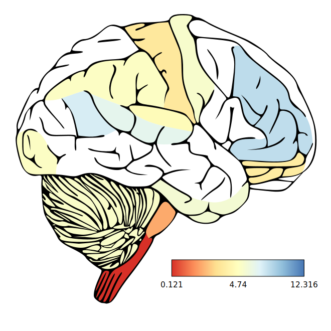 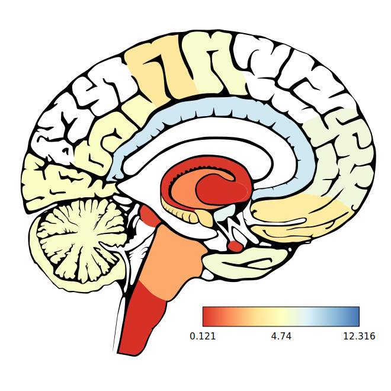 
***
***
<p align="right"> <a href="#top" >Back to top</a> </p>

# Brain Regions in cerebroViz {#regions}
Cerebroviz provides 30 regions to which brain data can be mapped. To view a data frame containing mapping of cerebroViz's regions to those of several popular databases:

```{r, echo = TRUE, results='hide'}
  data(regionMap)
  regionMap
```
```{r, echo=FALSE, results='asis'}
knitr::kable(regionMap)
```

Users are encouraged to name the rows of their data using the cerebroViz conventions described in the above table. If this is not possible,  a matrix with 2 columns, where [,1] contains cerebroViz convention names and [,2] contains the corresponding custom name can be passed to the `customNames = ` argument of cerebroViz. The names cerebroViz uses by convention are reserved, and my not be assigned to custom regions in this way. 

## Custom Regions Example
For example, renaming the medulla and pons (regions within the brain stem) in the cerebroEx example matrix results in an error, and those regions are not colored in the generated SVGs.
```{r, echo=TRUE}
rownames(cerebroEx)[c(13, 18)]
rownames(cerebroEx)[c(13, 18)] <- c('medulla', 'pons')
cerebroViz(cerebroEx, filePrefix = "missing_name")
```
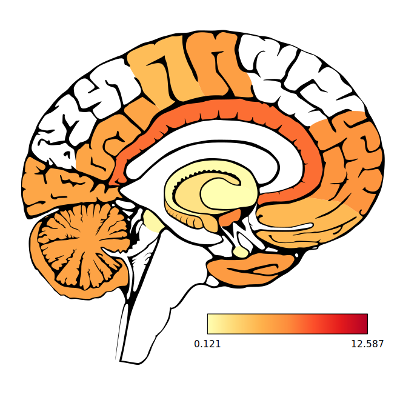  

***
To map these regions to our custom names, we create the 2 column matrix and pass it to the `customNames = ` argument of cerebroViz.
```{r, echo = TRUE}
matrix(c("PON", "MED","pons", "medulla"), ncol=2 ) -> cnm
cnm
cerebroViz(cerebroEx, customNames = cnm, filePrefix = "custom_name")
```
 

***
The data are now properly mapped to the corresponding regions. Note that both the "missing_name" and "custom_name" images have the same scale. cerebroViz uses all data in the supplied matrix to calculate its color scale, even those which cannot be mapped to regions in the output images. 

***
***
<p align="right"> <a href="#top" >Back to top</a> </p>

# Make an anigif
brew reinstall imagemagick --with-librsvg 

imagemagick
convert -delay 120 -loop 0 *_slice_*.svg animated.gif
